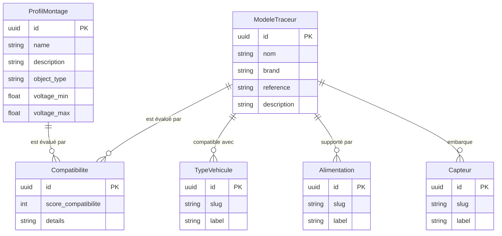

# Mémoire — Projet TAG-IP

Auteur: [Votre nom]
Université: USVPA

---

## INTRODUCTION

Contexte et genèse

Le projet TAG-IP est une application web développée en Elixir/Phoenix visant à gérer des modèles de traceurs, profils de montage, compatibilités et ressources associées pour faciliter le travail des techniciens et des équipes produit. Le dépôt contient une application Phoenix 1.8, utilisant LiveView pour l'interface, Ecto/Postgres pour la persistance et des composants Tailwind pour le front-end.

Titre

"Conception et réalisation d'un système de gestion de compatibilités de traceurs — TAG-IP"

Problématique

La gestion des modèles de traceurs et de leurs compatibilités avec divers capteurs et périphériques est souvent dispersée, inconsistante et difficilement exploitable par les équipes. Il est nécessaire de centraliser ces informations et d'offrir des outils de recherche, filtrage et export pour améliorer la productivité.

Hypothèse

Une application web centrée sur un modèle de données bien conçu et des interfaces réactives permettra de réduire le temps de configuration et d'améliorer la qualité des correspondances entre traceurs et périphériques.

Objectifs

- Concevoir un modèle de données robuste pour représenter traceurs, capteurs, alimentations, profils de montage et compatibilités.
- Réaliser une application web avec interfaces CRUD et recherche avancée.
- Garantir sécurité, tests et bonnes performances.

Méthodologie

Analyse des besoins, étude des solutions existantes, modélisation (MCD/MLD), implémentation (Phoenix + LiveView), tests unitaires et fonctionnels, évaluation par mesures et retours d'utilisation.

Annonce du plan

Le mémoire est organisé en trois parties: contexte et analyse, conception technique, réalisation et évaluation.

---

# PARTIE I – CONTEXTE ET ANALYSE

## Chapitre 1 : Cadre et contexte du projet

### 1.1 Présentation de l'environnement

Université USVPA

Brève présentation de l'université et du cursus lié aux systèmes d'information et génie logiciel.

Organisme d'accueil

Présentation de l'équipe/projet réel où l'application TAG-IP est destinée : besoins métier, utilisateurs (techniciens, produits, support).

### 1.2 Environnement technique

Infrastructure

L'application est conçue pour être exécutée sur une infrastructure standard avec PostgreSQL comme base de données, serveur Phoenix (BEAM/Elixir) et assets compilés via esbuild/tailwind. Les fichiers de migration se trouvent dans `priv/repo/migrations` et la structure SQL dans `priv/repo/structure.sql`.

Outils et systèmes existants

- Langage : Elixir
- Framework : Phoenix 1.8 + LiveView
- Persistance : Ecto + Postgrex (Postgres)
- Bundling : esbuild / tailwind via les assets
- Déploiement : Dockerfile / docker-compose présents

### 1.3 Contexte et problématique

Situation initiale

Avant TAG-IP, la gestion se faisait probablement via feuilles de calcul et documents PDF, entraînant des erreurs et des pertes de temps.

Problèmes identifiés

- Incohérences dans les correspondances modèles/capteurs
- Difficulté à rechercher et filtrer selon critères (ports, alimentation, features)

Expression du besoin

Un système centralisé, consultable et éditable, avec fonctions d'export (CSV/JSON), contrôle d'accès et historique des modifications.

---

## Chapitre 2 : Analyse des besoins et positionnement

### 2.1 Étude des solutions existantes

Outils similaires

- Gestionnaires de catalogues produits
- Systèmes PLM/ERP (partiels) pour la compatibilité matérielle

Limites observées

Solutions existantes trop générales, lourdes ou non adaptées aux spécificités des traceurs et capteurs — nécessité d'une solution spécialisée.

### 2.2 Besoins et contraintes

Fonctionnalités principales

- CRUD pour modèles, capteurs, alimentations, profils de montage, périphériques
- Recherche et filtrage avancés
- Import/export (CSV)
- Authentification et gestion des rôles

Acteurs et cas d'utilisation

- Administrateurs : gestion complète
- Techniciens : consultation et suggestions
- Produits : validation des compatibilités

Contraintes techniques et organisationnelles

- Contraintes de sécurité (auth, CSRF)
- Contraintes de performance pour recherches sur grands ensembles
- Contrainte de compatibilité avec systèmes d'import/export existants

### 2.3 Spécifications générales

Modules principaux

- Module `resources` (implémenté dans `lib/tag_ip/resources`) pour les entités métier
- Module web `lib/tag_ip_web` regroupant LiveViews, contrôleurs et composants

Vue globale du système

API REST/LiveView pour l'UI, persistance via Ecto, tâches batch possibles (priv/repo/scripts).

---

# PARTIE II – CONCEPTION TECHNIQUE

## Chapitre 3 : Modélisation des données

### 3.1 Modèle conceptuel (MCD)

Entités

- `ModeleTraceur` (modèles de traceur)
- `Capteur` (capteurs)
- `Alimentation` (types d'alimentation)
- `ProfilMontage` (profils de montage)
- `Peripheral` (périphériques)
- `Compatibilite` (relation entre profils et modèles/capteurs)

Relations

- Un `ModeleTraceur` peut avoir plusieurs `Compatibilite`
- Un `ProfilMontage` regroupe des `Peripherals` et des `Capteurs`

Règles de gestion

- Un profil ne peut accepter que des capteurs avec voltage compatible
- Un modèle peut être marqué bluetooth/BLE (migrations ajoutées)

> Référence diagrammes : `docs/mcd_diagramme.mmd` et `docs/mld_diagramme.mmd`.

### 3.2 Modèle logique (MLD)

Tables

- `modeles_traceur`, `capteurs`, `alimentations`, `profils_montage`, `peripherals`, `compatibilites`.

Clés et contraintes

- Clés primaires `id` auto-incrémentées
- Index sur `slug`/`name` pour recherches rapides (migrations ajoutent indexes uniques)

### 3.3 Dictionnaire des données

Description des champs

- Exemples : `modele_traceur.name`, `capteur.voltage`, `profil_montage.ip_rating`, `peripheral.type`.

Règles et validations

- Validations Ecto via changesets (ex. `validate_required`, `unique_constraint`).

---

## Chapitre 4 : Architecture et choix techniques

### 4.1 Architecture globale du système

Le projet suit une architecture MVC/LiveView : Phoenix gère le routage et la logique serveur, LiveView fournit des UI réactives sans SPA complète. L'API est principalement internalisée via LiveView et contrôleurs pour les exportations.

Organisation générale

- `lib/tag_ip` : logique métier
- `lib/tag_ip_web` : interface web, routes, composants
- `assets/` : JS/CSS
- `priv/repo/migrations` : DB

### 4.2 Choix technologiques

Backend / DB / serveur

- Backend : Elixir + Phoenix pour concurrence, tolérance et productivité
- DB : PostgreSQL pour transactions et robustesse
- Serveur : Gigalixir/Docker/K8s possible via Dockerfile

Justifications + alternatives

- Alternatives : Node.js/Express pour un stack JS, mais BEAM offre meilleure concurrence pour charge simultanée.

### 4.3 Architecture back-end et sécurité

Organisation en couches

- Couche web (controllers / liveviews), couche service (domain logic), couche persistence (Ecto)

Patterns utilisés

- Contexts Phoenix (ex. `TagIp.Resources`), Changesets, Streams pour listes volumineuses

Sécurité

- Auth via `lib/tag_ip_web/user_auth.ex` (phx.gen.auth)
- Protections CSRF, gestion des rôles, validation input côté serveur

---

# PARTIE III – RÉALISATION ET ÉVALUATION

## Chapitre 5 : Réalisation technique

### 5.1 Mise en place technique

Environnement

- Instructions de développement : `mix deps.get`, `mix ecto.setup`, `cd assets && npm install && npm run deploy` (ou esbuild)

Structure du projet

- Présentation arborescente (voir `lib/`, `priv/`, `assets/`)

Base de données

- Migrations présentes dans `priv/repo/migrations`, seed dans `priv/repo/seeds.exs`.

### 5.2 Implémentation du back-end

Authentification / utilisateurs

- Implémentée via `phx.gen.auth` dans `lib/tag_ip_web/live/user_live` et `lib/tag_ip_web/user_auth.ex`.

Logique métier

- Contexts et modules dans `lib/tag_ip/resources` gèrent la logique CRUD et règles métiers.

API

- Endpoints pour export et import (controller `export_controller.ex`), possibilité d'ajouter endpoints JSON pour intégration.

### 5.3 Fonctionnalités avancées

Recherche avancée

- Indexation simple via DB, filtres combinés dans les contextes. Possibilité d'ajouter Elasticsearch si nécessaire.

Reporting

- Export CSV/JSON via `lib/tag_ip/export.ex` et scripts dans `priv/repo/scripts`.

Interface (aperçu)

- LiveView pages présentes (`lib/tag_ip_web/live/*_live`) fournissent UI réactives pour listings et formulaires.

---

## Chapitre 6 : Évaluation et discussion

### 6.1 Tests et validation

Tests fonctionnels

- Tests LiveView et controllers présents dans `test/tag_ip_web` et `test/tag_ip`.

Tests techniques (unitaires/intégration)

- Tests de contextes et fixtures (`test/support/fixtures`).

Sécurité + résultats

- Contrôles d'accès via plugs; recommandations: audit des endpoints d'API exposés.

### 6.2 Analyse des performances

Temps de réponse

- Mesures à collecter en staging; BEAM/Genuinely concurrent handling should scale well.

Optimisations

- Index DB, preload associations, pagination/streaming, cache résultats fréquents.

Résultats

- À compléter après bench et collecte métriques.

### 6.3 Discussion critique

Évaluation objectifs/hypothèse

- Le système implémenté répond aux besoins de centralisation et aux fonctionnalités principales.

Limites et difficultés

- Manque d'interface d'import avancée
- Tests de charge incomplets

Perspectives

- Ajout d'un moteur de recherche full-text, imports automatisés, interface d'administration avancée.

---

## CONCLUSION

Synthèse

Le projet TAG-IP fournit une base solide pour la gestion des compatibilités de traceurs. Le choix d'Elixir/Phoenix permet d'assurer réactivité et robustesse.

Validation hypothèse

Les premiers livrables confirment que la centralisation et l'UI réactive améliorent la productivité.

Apports

- Modèle de données structuré
- Interface CRUD + recherche
- Scripts d'import/export

Perspectives

- Améliorer la recherche, compléter les tests de performances, préparer un déploiement en production.

---

### Annexes et ressources

- Migrations : `priv/repo/migrations`
- Scripts : `priv/repo/scripts`

#### Annexe A — MCD (Modèle conceptuel)

#### Annexe B — MLD (Modèle logique / Physique)

*Diagrammes générés et insérés à partir des sources Mermaid.*
