# Mémoire — Projet TAG-IP (Version étendue)

Auteur: [Votre nom]
Université: USVPA

---

## INTRODUCTION (1 page)

Contexte et genèse

Le présent mémoire documente la conception, le développement et l'évaluation d'une application web nommée TAG-IP destinée à centraliser et faciliter la gestion des modèles de traceurs, des capteurs, des alimentations, des profils de montage et des compatibilités associées. Le projet est né d'un besoin exprimé par une équipe technique confrontée à la dispersion d'informations critiques dans des fichiers hétérogènes (feuilles de calcul, documents Word/PDF, e-mails) et à des erreurs fréquentes lors des phases d'intégration matérielle.

Titre

Conception et réalisation d'un système de gestion de compatibilités de traceurs — TAG-IP

Problématique

Comment concevoir et implémenter un système centralisé, fiable et évolutif pour gérer les compatibilités entre modèles de traceurs et composants périphériques afin de réduire les erreurs opérationnelles et le temps de configuration ?

Hypothèse

La mise en place d'une solution web, reposant sur un modèle de données robuste et des interfaces réactives, permettra d'améliorer la qualité des correspondances entre traceurs et composants et de diminuer le temps nécessaire à la configuration et à la validation.

Objectifs

- Modéliser les entités métiers et leurs relations pour couvrir les besoins fonctionnels.
- Implémenter une application Phoenix/LiveView offrant des interfaces CRUD, des outils de recherche et des exports.
- Mettre en place des tests et des mécanismes de sécurité pour assurer la qualité.

Méthodologie

Méthode itérative : analyse des besoins, étude des solutions existantes, modélisation (MCD/MLD), implémentation incrémentale, tests automatiques, déploiement en environnement de test et évaluation.

Annonce du plan

Le mémoire est structuré en trois grandes parties : contexte et analyse, conception technique, réalisation et évaluation. Chaque partie contient deux chapitres développés.

---

# PARTIE I – CONTEXTE ET ANALYSE

## Chapitre 1 : Cadre et contexte du projet (8 pages)

1.1 Présentation de l'environnement

Université USVPA

Présentation succincte de l'université, des formations pertinentes (informatique, génie logiciel) et du contexte pédagogique reliant le projet au cursus. Discussion sur le rôle des projets appliqués dans la formation d'ingénieurs logiciels et l'importance des projets industriels pour établir des compétences métiers.

Organisme d'accueil

Description détaillée de l'organisme ou de l'équipe qui a commandité le projet : mission, organisation, équipes techniques (produit, R&D, support), processus actuels de gestion de catalogues produits et compatibilités. Exemples concrets de cas d'utilisation rencontrés par l'organisme, volume estimé d'objets à gérer (nombre de modèles, capteurs), et enjeux opérationnels (délais, coûts, erreurs).

1.2 Environnement technique

Infrastructure

Analyse de l'infrastructure cible et de la pile technique retenue : raisons du choix d'Elixir/BEAM pour la concurrence et la tolérance, choix de PostgreSQL pour la cohérence transactionnelle, et utilisation de Docker pour la reproductibilité. Description des artefacts présents dans le dépôt : migrations SQL (`priv/repo/migrations`), bundle d'assets (`assets/`), scripts d'import/export (`priv/repo/scripts`).

Outils et systèmes existants

Recensement des outils déjà présents ou susceptibles d'interfacer le système : feuilles de calcul Excel/CSV existantes, systèmes ERP/PLM (s'ils existent), pipelines d'intégration existants. Évaluation des niveaux d'interopérabilité et des formats d'échange requis (CSV, JSON, API REST).

1.3 Contexte et problématique

Situation initiale

Description détaillée de la situation avant projet : processus manuels, responsabilités floues, flux d'information fragmentés. Exemples d'incidents ou de perte de productivité causés par l'absence d'un référentiel central.

Problèmes identifiés

Analyse structurée des problèmes : redondance de données, incohérences, manque de traçabilité, absence d'outils de recherche rapides, contraintes dans les processus d'export.

Expression du besoin

Formulation des besoins fonctionnels et non fonctionnels sous forme de listes et de priorisation (MoSCoW si souhaité). Besoin d'interfaces web sécurisées, d'exports, de gestion des accès et d'une API pour intégration.

Conclusion du chapitre

Synthèse positionnant clairement le périmètre du projet et les objectifs à atteindre pour la conception.

---

## Chapitre 2 : Analyse des besoins et positionnement (8 pages)

2.1 Étude des solutions existantes

Outils similaires

Revue critique des outils présents sur le marché ou open-source pour la gestion de catalogues et compatibilités : comparateurs, gestionnaires de composants, solutions PLM/ERP. Pour chaque outil, description synthétique, cas d'usage, coûts et limitations.

Limites observées

Analyse des lacunes : difficulté d'adaptation aux spécificités des traceurs, coût et complexité de mise en place, absence de fonctions de recherche multicritères adaptées.

2.2 Besoins et contraintes

Fonctionnalités principales

Description détaillée des fonctionnalités attendues (CRUD, filtres multi-critères, correspondance de versions, historique des modifications, export CSV/JSON, gestion des rôles et permissions).

Acteurs et cas d'utilisation

Identification des acteurs (admin, technicien, produit, intégrateur) et scénarios détaillés (use cases) : création d'un modèle, ajout d'une compatibilité, recherche d'un modèle compatible, export d'un référentiel pour intégration usine.

Contraintes techniques et organisationnelles

Contraintes de sécurité, exigences de performance (temps de réponse pour recherches), contraintes d'évolution (ajout de nouvelles propriétés), règles de gouvernance des données.

2.3 Spécifications générales

Modules principaux

Description des modules : `Resources` (métier), `Web` (UI/LiveView), `Export`, `Import`, `Auth`. Définition claire des responsabilités de chaque module et exemples d'API publiques internes aux contexts.

Vue globale du système

Schéma d'architecture (texte et renvoi aux diagrammes MCD/MLD existants). Flux de données typiques : création → validation → exportation.

Conclusion du chapitre

Validation des spécifications avec le besoin initial et préparation de la phase de conception.

---

# PARTIE II – CONCEPTION TECHNIQUE

## Chapitre 3 : Modélisation des données (8 pages)

3.1 Modèle conceptuel (MCD)

Entités

Description approfondie des entités métier identifiées avec leurs attributs essentiels et exemples concrets :

- `ModeleTraceur` : identifiant, nom, référence constructeur, features (BLE, Bluetooth, GNSS), image, notes.
- `Capteur` : type, voltage nominal, tolérance, empreinte physique (connecteur), catégorie.
- `Alimentation` : type, voltage, intensité max.
- `ProfilMontage` : type d'enclosure, IP rating, orientation, notes de montage.
- `Peripheral` : nom, type (antenne, câbles), contraintes physiques.
- `Compatibilite` : relation entre `ModeleTraceur` et `ProfilMontage`/`Capteur` incluant critères (ports, voltage, options supportées).

Relations

Détailler cardinalités, sens et règles (ex. un `ModeleTraceur` possède plusieurs `Compatibilite`, un `ProfilMontage` est relié à plusieurs `Peripherals`).

Règles de gestion

Listeners sur événements métier, règles de validation (voltage compatible, versioning des compatibilités), politiques de suppression (soft-delete vs hard-delete).

3.2 Modèle logique (MLD)

Tables

Tables proposées avec exemples de colonnes et types SQL : `modeles_traceur(id, name, slug, bluetooth, ble, ... )`, `capteurs(id, name, voltage_min, voltage_max, ...)`, `compatibilites(id, modele_id, profil_id, notes, valid_from)`.

Clés et contraintes

Contraintes d'intégrité référentielle (foreign keys), indexes recommandés (sur `slug`, `name`, `modele_id`), et contraintes d'unicité pour éviter doublons.

3.3 Dictionnaire des données

Description détaillée des champs avec exemples de valeurs, format, unités et validations associées (ex.: `voltage` en volts float, `ip_rating` en string avec pattern). Liste des validations Ecto à appliquer dans les changesets.

Annexe : diagrammes

Renvoi aux fichiers `docs/mcd_diagramme.mmd` et `docs/mld_diagramme.mmd` pour visualisation. Si besoin, ces diagrammes seront exportés en PNG/SVG pour inclusion dans la version finale.

---

## Chapitre 4 : Architecture et choix techniques (8 pages)

4.1 Architecture globale du système

Description architecturale détaillée : couches (presentation, application, domain, persistence), diagramme d'interaction, justification du modèle LiveView pour minimiser le JavaScript côté client.

Organisation générale

Arborescence du projet et conventions de code (naming, contexts Phoenix, tests). Démonstration par exemples de modules dans `lib/` et LiveViews existants.

4.2 Choix technologiques

Backend / DB / serveur

Argumentaire sur Elixir/OTP pour la robustesse, choix Postgres pour la gestion relationnelle, utilisation d'esbuild et Tailwind pour les assets. Option de déploiement via Dockerfile/docker-compose fournis dans le dépôt.

Justifications + alternatives

Analyse coûts/bénéfices des alternatives (Node.js, Django, Rails) et raisons pour lesquelles la stack actuelle est préférable pour ce projet.

4.3 Architecture back-end et sécurité

Organisation en couches

Détail sur l'organisation par contextes Phoenix, modules de service, adaptateurs (Repo), et comment cela facilite les tests et la maintenance.

Patterns utilisés

Patterns identifiés : repository pattern via Ecto contexts, changesets pour validation, strategy pattern pour importeurs/exporteurs.

Sécurité

Mesures mises en place : `phx.gen.auth`, gestion des sessions, rôles, politiques d'accès, protections CSRF et validation serveur. Recommandations supplémentaires pour audits et gestion de secrets.

---

# PARTIE III – RÉALISATION ET ÉVALUATION

## Chapitre 5 : Réalisation technique (8 pages)

5.1 Mise en place technique

Environnement de développement

Procédure détaillée d'initialisation du projet localement :

```bash
mix deps.get
mix ecto.setup
cd assets
npm install # ou yarn
npm run build
mix phx.server
```

Structure du projet

Description des dossiers clés et rôle de chacun (`lib/tag_ip`, `lib/tag_ip_web`, `priv/repo`, `assets`). Exemples de fichiers importants (`mix.exs`, `config/*.exs`, `Dockerfile`).

Base de données

Détails sur les migrations disponibles, stratégie de seeds, et scripts utilitaires dans `priv/repo/scripts` qui facilitent l'import ou la transformation des CSV.

5.2 Implémentation du back-end

Authentification / utilisateurs

Description de l'implémentation de l'authentification (phx.gen.auth) : gestion des comptes, reset de mot de passe, confirmation d'email, et gestion de sessions LiveView.

Logique métier

Organisation des contexts dans `lib/tag_ip/resources`. Exemples de fonctions : `create_model/1`, `list_compatibilities/1`, `suggest_port_matches/2`.

API

Endpoints exposés (controllers) pour l'export CSV/JSON (`ExportController`) et possibilité d'ajouter endpoints REST pour intégration externe. Gestion des performances via pagination et streaming.

5.3 Fonctionnalités avancées

Recherche avancée

Implémentation de filtres combinés dans les contexts, pagination LiveView, et proposition d'ajout d'un moteur full-text (Postgres tsvector ou Elastic) pour recherches sémantiques.

Reporting

Description des exports disponibles, exemples de formats, et scripts pour génération de rapports périodiques.

Interface (aperçu)

Screenshots/description des LiveViews clés : listes, formulaires d'édition, pages de compatibilité. Mention de composants réutilisables (`core_components.ex`).

---

## Chapitre 6 : Évaluation et discussion (8 pages)

6.1 Tests et validation

Tests fonctionnels

Recensement des tests LiveView/Controller présents dans `test/` et stratégie de tests manuels pour valider workflows critiques.

Tests techniques (unitaires/intégration)

Exemples de tests de contexts, fixtures d'exemple dans `test/support/fixtures`, et mode d'exécution (`mix test`). Intégration continue via `.github/workflows/ci.yml`.

Sécurité + résultats

Résultats des vérifications de sécurité (revues de code, protections standard). Recommandations pour tests de pénétration et audits réguliers.

6.2 Analyse des performances

Temps de réponse

Approche pour mesurer (ab bench, siege, wrk), scénarios testés, et seuils acceptables. Relevés attendus pour différentes tailles de base (ex : 10k, 100k enregistrements).

Optimisations

Techniques mises en place : indexes, préchargement (`preload`), pagination/streams, caches côté application si nécessaire.

Résultats

Indicateurs à collecter en staging avant livraison en production.

6.3 Discussion critique

Évaluation objectifs/hypothèse

Retour critique : points atteints, bénéfices observés, éléments restant à améliorer.

Limites et difficultés

Limites techniques (notamment pour imports massifs), culturelles (adoption par utilisateurs) et contraintes temporelles.

Perspectives

Roadmap possible : moteur de recherche, automatisation des imports, API publique, tableau de bord analytique.

---

## CONCLUSION (1 page)

Synthèse

Rappel des apports majeurs du projet TAG-IP : centralisation, modèle de données, interface réactive, export.

Validation hypothèse

L'hypothèse initiale est partiellement confirmée : la centralisation et UI améliorent la productivité, mais des métriques de terrain restent à collecter.

Apports

- Base de code structurée et testée
- Outils d'import/export et scripts d'administration

Perspectives

Améliorations à court/moyen terme et pistes de recherche.

---

## Annexes

- Migrations : `priv/repo/migrations`
- Scripts : `priv/repo/scripts`

### Annexe A — MCD (Modèle conceptuel)

```mermaid
%% ============================================================================
%% MCD — MODÈLE CONCEPTUEL DE DONNÉES
%% Projet TagIp : Système d'aide à la décision pour la sélection de traceurs GPS
%% ============================================================================

erDiagram
	%% =========================================================================
	%% ENTITÉ : PROFIL MONTAGE
	%% =========================================================================
	ProfilMontage {
		uuid id PK  "Identifiant unique (UUID v4)"
		string name "[OBLIGATOIRE] Nom unique du profil (ex: Camion longue distance)"
		string description "Description libre du contexte d'installation"
		string object_type "Type d'objet (slug: car, truck, motorcycle…)"
		float voltage_min "Tension minimale en volts (ex: 10.8)"
		float voltage_max "Tension maximale en volts (ex: 32.0)"
		boolean buzzer "Buzzer intégré requis ?"
		string fuel_probe_type "Type sonde carburant (analog, digital, null)"
		boolean geofence_enabled "Géofencing requis ?"
		string driver_id_type "Type ID conducteur (iButton, RFID, Bluetooth)"
		string reporting_interval "Intervalle de rapport (ex: 10s, 60s)"
		boolean can_bus_requis "Interface CAN-Bus requise"
		boolean one_wire_requis "Interface 1-Wire requise"
		boolean rs232_requis "Interface RS232 requise"
		boolean rs485_requis "Interface RS485 requise"
		int inputs_requis "Nombre d'entrées numériques requises"
		int analog_inputs_requis "Nombre d'entrées analogiques requises"
		int outputs_requis "Nombre de sorties requises"
		string ip_rating "Indice de protection IP minimal requis"
		boolean montage_exterieur "Installation en extérieur ?"
		boolean antenne_deportee "Antenne déportée nécessaire ?"
		boolean accelerometre_requis "Accéléromètre 3 axes requis ?"
		int buffer_requis "Mémoire tampon requise (MB)"
		boolean ultra_low_power_requis "Mode ultra-low power requis ?"
		uuid organization_id "ID organisation (multi-tenant futur)"
	}

	%% =========================================================================
	%% ENTITÉ : MODÈLE TRACEUR
	%% =========================================================================
	ModeleTraceur {
		uuid id PK  "Identifiant unique (UUID v4)"
		string nom "[OBLIGATOIRE] Nom commercial (ex: FMB920)"
		string brand "Marque / fabricant (ex: Teltonika)"
		string reference "[OBLIGATOIRE] Référence constructeur unique"
		string description "Description libre du produit"
		boolean can_bus "Support CAN-Bus"
		boolean one_wire "Support 1-Wire"
		boolean rs232 "Support RS232"
		boolean rs485 "Support RS485"
		int nb_digital_inputs "Nombre d'entrées numériques disponibles"
		int nb_analog_inputs "Nombre d'entrées analogiques disponibles"
		int nb_outputs "Nombre de sorties disponibles"
		string ip_rating "Indice de protection IP du boîtier"
		boolean accelerometer "Accéléromètre 3 axes intégré ?"
		int buffer_memory "Mémoire tampon embarquée (MB)"
		boolean antennes_externes "Connecteurs antennes externes ?"
		boolean ultra_low_power "Mode ultra-low power supporté ?"
		float standby_current "Courant de veille (mA)"
	}

	%% =========================================================================
	%% ENTITÉ : COMPATIBILITÉ (Entité associative)
	%% =========================================================================
	Compatibilite {
		uuid id PK  "Identifiant unique (UUID v4)"
		int score_compatibilite "[0-100] Score calculé (seuil 40 = compatible)"
		string details "Rapport détaillé des 17 critères"
	}

	%% =========================================================================
	%% ENTITÉS DE RÉFÉRENCE
	%% =========================================================================
	TypeVehicule {
		uuid id PK  "Identifiant unique (UUID v4)"
		string slug "[OBLIGATOIRE] Identifiant court (car, truck…)"
		string label "[OBLIGATOIRE] Libellé lisible (Voiture, Camion…)"
	}

	Alimentation {
		uuid id PK  "Identifiant unique (UUID v4)"
		string slug "[OBLIGATOIRE] Slug (12v, 24v, 9_36v…)"
		string label "[OBLIGATOIRE] Libellé (12V, 24V, 9-36V…)"
	}

	Capteur {
		uuid id PK  "Identifiant unique (UUID v4)"
		string slug "[OBLIGATOIRE] Slug (buzzer, geofence, fuel_probe_analog…)"
		string label "[OBLIGATOIRE] Libellé (Buzzer, Géofencing…)"
	}

	TrackableType {
		uuid id PK  "Identifiant unique (UUID v4)"
		string slug "[OBLIGATOIRE] Slug unique"
		string label "[OBLIGATOIRE] Libellé lisible"
		string description "Description optionnelle"
	}

	Feature {
		uuid id PK  "Identifiant unique (UUID v4)"
		string slug "[OBLIGATOIRE] Slug (bluetooth_ble, eco_driving…)"
		string label "[OBLIGATOIRE] Libellé"
		string description "Description optionnelle"
	}

	PortType {
		uuid id PK  "Identifiant unique (UUID v4)"
		string slug "[OBLIGATOIRE] Slug (digital_input, 1_wire, rs232…)"
		string label "[OBLIGATOIRE] Libellé"
		string description "Description optionnelle"
	}

	%% =========================================================================
	%% ENTITÉS DE JONCTION
	%% =========================================================================
	ModeleTraceurTypeVehicule {
		uuid id PK  "Identifiant unique (UUID v4)"
	}

	ModeleTraceurAlimentation {
		uuid id PK  "Identifiant unique (UUID v4)"
	}

	ModeleTraceurCapteur {
		uuid id PK  "Identifiant unique (UUID v4)"
	}

	ModelFeature {
		uuid id PK  "Identifiant unique (UUID v4)"
	}

	ModelPort {
		uuid id PK  "Identifiant unique (UUID v4)"
		string pin_label "[OBLIGATOIRE] Nom logique de la broche (DIN1, AIN2…)"
	}

	%% =========================================================================
	%% ENTITÉ : PÉRIPHÉRIQUE
	%% =========================================================================
	Peripheral {
		uuid id PK  "Identifiant unique (UUID v4)"
		string name "[OBLIGATOIRE] Nom commercial"
		string description "Description"
	}

	%% =========================================================================
	%% ENTITÉS D'AUTHENTIFICATION (Ecto)
	%% =========================================================================
	User {
		bigint id PK  "Identifiant auto-incrémenté"
		citext email "[OBLIGATOIRE] Adresse email (identifiant login)"
		string hashed_password "[OBLIGATOIRE] Mot de passe haché (Bcrypt)"
		datetime confirmed_at "Date de confirmation du compte"
	}

	UserToken {
		bigint id PK  "Identifiant auto-incrémenté"
		binary token "[OBLIGATOIRE] Token haché (SHA-256)"
		string context "[OBLIGATOIRE] Contexte: session, login, change:email…"
		string sent_to "Email de destination (traçabilité)"
		datetime authenticated_at "Dernière utilisation"
	}

	%% =========================================================================
	%% RELATIONS
	%% =========================================================================

	ProfilMontage ||--o{ Compatibilite : "est évalué par"
	ModeleTraceur ||--o{ Compatibilite : "est évalué par"

	ModeleTraceur ||--o{ ModeleTraceurTypeVehicule : "compatible avec"
	TypeVehicule ||--o{ ModeleTraceurTypeVehicule : "associé à"

	ModeleTraceur ||--o{ ModeleTraceurAlimentation : "supporté par"
	Alimentation ||--o{ ModeleTraceurAlimentation : "alimente"

	ModeleTraceur ||--o{ ModeleTraceurCapteur : "embarque"
	Capteur ||--o{ ModeleTraceurCapteur : "équippé de"

	ModeleTraceur ||--o{ ModelFeature : "doté de"
	Feature ||--o{ ModelFeature : "présent sur"

	ModeleTraceur ||--o{ ModelPort : "expose"
	PortType ||--o{ ModelPort : "classifie comme"

	PortType ||--o{ Peripheral : "permet"

	User ||--o{ UserToken : "possède"
```



### Annexe B — MLD (Modèle logique / Physique)

```mermaid
%% ============================================================================
%% MLD — MODÈLE LOGIQUE DE DONNÉES (Physique)
%% Projet TagIp : Schéma PostgreSQL — Approche hybride Ecto + AshPostgres
%% ============================================================================

erDiagram
	%% =========================================================================
	%% ZONE MÉTIER — Ressources Ash (domaines: TagIp.Resources & TagIp.TagIp)
	%% =========================================================================

	mounting_profiles {
		uuid id PK  "gen_random_uuid()"
		text name "UNIQUE NOT NULL — Nom du profil"
		text description "NULL — Description libre"
		text object_type "NULL — Slug du type de véhicule"
		float voltage_min "NULL — Tension min (volts)"
		float voltage_max "NULL — Tension max (volts)"
		boolean can_bus_requis "NOT NULL DEFAULT false"
		boolean one_wire_requis "NOT NULL DEFAULT false"
		boolean rs232_requis "NOT NULL DEFAULT false"
		boolean rs485_requis "NOT NULL DEFAULT false"
		int inputs_requis "NOT NULL DEFAULT 0 — CHECK >= 0"
		int analog_inputs_requis "NOT NULL DEFAULT 0 — CHECK >= 0"
		int outputs_requis "NOT NULL DEFAULT 0 — CHECK >= 0"
		text ip_rating "NULL — ex: IP65"
		boolean montage_exterieur "NOT NULL DEFAULT false"
		boolean buzzer "NOT NULL DEFAULT false"
		boolean geofence_enabled "NOT NULL DEFAULT false"
		text fuel_probe_type "NULL — analog|digital|null"
		boolean accelerometre_requis "NOT NULL DEFAULT false"
		int buffer_requis "NOT NULL DEFAULT 0 — CHECK >= 0"
		boolean ultra_low_power_requis "NOT NULL DEFAULT false"
		boolean antenne_deportee "NOT NULL DEFAULT false"
		text reporting_interval "NULL"
		text driver_id_type "NULL"
		uuid organization_id "NULL — Pour multi-tenant futur"
		timestamp inserted_at "NOT NULL DEFAULT now()"
		timestamp updated_at "NOT NULL DEFAULT now()"
	}

	modeles_traceur {
		uuid id PK  "gen_random_uuid()"
		varchar(100) nom "NOT NULL — Nom commercial"
		varchar(50) reference "UNIQUE NOT NULL — Réf. constructeur"
		text brand "NULL — Marque/fabricant"
		varchar(500) description "NULL"
		boolean can_bus "NOT NULL DEFAULT false"
		boolean one_wire "NOT NULL DEFAULT false"
		boolean rs232 "NOT NULL DEFAULT false"
		boolean rs485 "NOT NULL DEFAULT false"
		int nb_digital_inputs "NOT NULL DEFAULT 0 — CHECK >= 0"
		int nb_analog_inputs "NOT NULL DEFAULT 0 — CHECK >= 0"
		int nb_outputs "NOT NULL DEFAULT 0 — CHECK >= 0"
		varchar(10) ip_rating "NULL"
		boolean accelerometer "NOT NULL DEFAULT false"
		int buffer_memory "NOT NULL DEFAULT 0 — CHECK >= 0"
		boolean antennes_externes "NOT NULL DEFAULT false"
		boolean ultra_low_power "NOT NULL DEFAULT false"
		float standby_current "NULL — Courant de veille (mA)"
		timestamp inserted_at "NOT NULL DEFAULT now()"
		timestamp updated_at "NOT NULL DEFAULT now()"
	}

	compatibilites {
		uuid id PK  "gen_random_uuid()"
		uuid profil_montage_id FK "NOT NULL — FK -> mounting_profiles(id) ON DELETE CASCADE"
		uuid modele_traceur_id FK "NOT NULL — FK -> modeles_traceur(id) ON DELETE CASCADE"
		int score_compatibilite "NOT NULL DEFAULT 0 — CHECK 0-100"
		text details "NULL — Rapport JSON/texte des 17 critères"
		timestamp inserted_at "NOT NULL DEFAULT now()"
		timestamp updated_at "NOT NULL DEFAULT now()"
	}

	types_vehicule {
		uuid id PK  "gen_random_uuid()"
		varchar(50) slug "UNIQUE NOT NULL — ex: car, truck, motorcycle"
		varchar(100) label "NOT NULL — ex: Voiture, Camion, Moto"
		timestamp inserted_at "NOT NULL DEFAULT now()"
		timestamp updated_at "NOT NULL DEFAULT now()"
	}

	alimentations {
		uuid id PK  "gen_random_uuid()"
		varchar(50) slug "UNIQUE NOT NULL — ex: 12v, 24v, 9_36v"
		varchar(100) label "NOT NULL — ex: 12V, 24V, 9-36V"
		timestamp inserted_at "NOT NULL DEFAULT now()"
		timestamp updated_at "NOT NULL DEFAULT now()"
	}

	capteurs {
		uuid id PK  "gen_random_uuid()"
		varchar(50) slug "UNIQUE NOT NULL — ex: buzzer, geofence"
		varchar(100) label "NOT NULL — ex: Buzzer, Géofencing"
		timestamp inserted_at "NOT NULL DEFAULT now()"
		timestamp updated_at "NOT NULL DEFAULT now()"
	}

	trackable_types {
		uuid id PK  "gen_random_uuid()"
		text slug "UNIQUE NOT NULL — Importé depuis CSV"
		text label "NOT NULL"
		text description "NULL"
		timestamp inserted_at "NOT NULL DEFAULT now()"
		timestamp updated_at "NOT NULL DEFAULT now()"
	}

	features {
		uuid id PK  "gen_random_uuid()"
		varchar(50) slug "UNIQUE NOT NULL"
		varchar(100) label "NOT NULL"
		text description "NULL"
		timestamp inserted_at "NOT NULL DEFAULT now()"
		timestamp updated_at "NOT NULL DEFAULT now()"
	}

	port_types {
		uuid id PK  "gen_random_uuid()"
		varchar(50) slug "UNIQUE NOT NULL"
		varchar(100) label "NOT NULL"
		text description "NULL"
		timestamp inserted_at "NOT NULL DEFAULT now()"
		timestamp updated_at "NOT NULL DEFAULT now()"
	}

	peripherals {
		uuid id PK  "gen_random_uuid()"
		uuid port_type_id FK "NOT NULL — FK -> port_types(id)"
		text name "NOT NULL"
		text description "NULL"
		timestamp inserted_at "NOT NULL DEFAULT now()"
		timestamp updated_at "NOT NULL DEFAULT now()"
	}

	modeles_traceur_types_vehicule {
		uuid id PK  "gen_random_uuid()"
		uuid modele_traceur_id FK "NOT NULL — FK -> modeles_traceur(id) ON DELETE CASCADE"
		uuid type_vehicule_id FK "NOT NULL — FK -> types_vehicule(id) ON DELETE CASCADE"
		timestamp inserted_at "NOT NULL DEFAULT now()"
		timestamp updated_at "NOT NULL DEFAULT now()"
	}

	modeles_traceur_alimentations {
		uuid id PK  "gen_random_uuid()"
		uuid modele_traceur_id FK "NOT NULL — FK -> modeles_traceur(id) ON DELETE CASCADE"
		uuid alimentation_id FK "NOT NULL — FK -> alimentations(id) ON DELETE CASCADE"
		timestamp inserted_at "NOT NULL DEFAULT now()"
		timestamp updated_at "NOT NULL DEFAULT now()"
	}

	modeles_traceur_capteurs {
		uuid id PK  "gen_random_uuid()"
		uuid modele_traceur_id FK "NOT NULL — FK -> modeles_traceur(id) ON DELETE CASCADE"
		uuid capteur_id FK "NOT NULL — FK -> capteurs(id) ON DELETE CASCADE"
		timestamp inserted_at "NOT NULL DEFAULT now()"
		timestamp updated_at "NOT NULL DEFAULT now()"
	}

	model_features {
		uuid id PK  "gen_random_uuid()"
		uuid modele_traceur_id FK "NOT NULL — FK -> modeles_traceur(id) ON DELETE CASCADE"
		uuid feature_id FK "NOT NULL — FK -> features(id) ON DELETE CASCADE"
		timestamp inserted_at "NOT NULL DEFAULT now()"
		timestamp updated_at "NOT NULL DEFAULT now()"
	}

	model_ports {
		uuid id PK  "gen_random_uuid()"
		uuid modele_traceur_id FK "NOT NULL — FK -> modeles_traceur(id) ON DELETE CASCADE"
		uuid port_type_id FK "NOT NULL — FK -> port_types(id)"
		text pin_label "NOT NULL — ex: DIN1, AIN2, RS232_TX"
		timestamp inserted_at "NOT NULL DEFAULT now()"
		timestamp updated_at "NOT NULL DEFAULT now()"
	}

	users {
		bigint id PK  "Auto-incrémenté (bigserial)"
		citext email "UNIQUE NOT NULL — Identifiant de connexion"
		varchar(255) hashed_password "NOT NULL — Hash Bcrypt (coût 12)"
		timestamp confirmed_at "NULL — Date de confirmation"
		timestamp inserted_at "NOT NULL DEFAULT now()"
		timestamp updated_at "NOT NULL DEFAULT now()"
	}

	users_tokens {
		bigint id PK  "Auto-incrémenté (bigserial)"
		bigint user_id FK "NOT NULL — FK -> users(id) ON DELETE CASCADE"
		bytea token "NOT NULL — SHA-256 hash du token"
		varchar(50) context "NOT NULL — session|login|reset_password|change:email"
		varchar(255) sent_to "NULL — Email de destination"
		timestamp authenticated_at "NULL — Dernière utilisation"
		timestamp inserted_at "NOT NULL DEFAULT now()"
	}

	mounting_profiles ||--o{ compatibilites : "1,N — profil_montage_id FK CASCADE"
	modeles_traceur ||--o{ compatibilites : "1,N — modele_traceur_id FK CASCADE"

	modeles_traceur ||--o{ modeles_traceur_types_vehicule : "1,N — CASCADE"
	types_vehicule ||--o{ modeles_traceur_types_vehicule : "1,N — CASCADE"

	modeles_traceur ||--o{ modeles_traceur_alimentations : "1,N — CASCADE"
	alimentations ||--o{ modeles_traceur_alimentations : "1,N — CASCADE"

	modeles_traceur ||--o{ modeles_traceur_capteurs : "1,N — CASCADE"
	capteurs ||--o{ modeles_traceur_capteurs : "1,N — CASCADE"

	modeles_traceur ||--o{ model_features : "1,N — CASCADE"
	features ||--o{ model_features : "1,N — CASCADE"

	modeles_traceur ||--o{ model_ports : "1,N — CASCADE"
	port_types ||--o{ model_ports : "1,N"

	port_types ||--o{ peripherals : "1,N"

	users ||--o{ users_tokens : "1,N — FK CASCADE"
```



*Diagrammes insérés depuis `docs/mcd_diagramme.mmd` et `docs/mld_diagramme.mmd`.*

